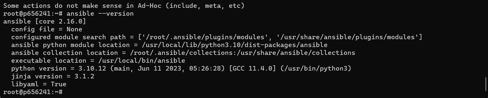
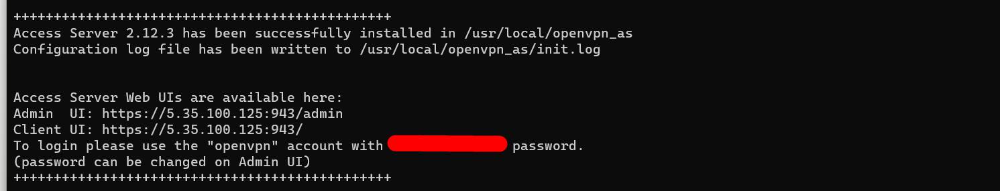
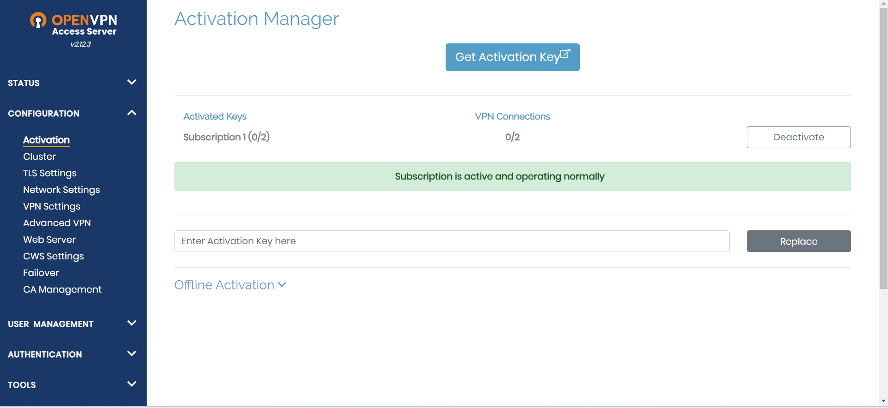
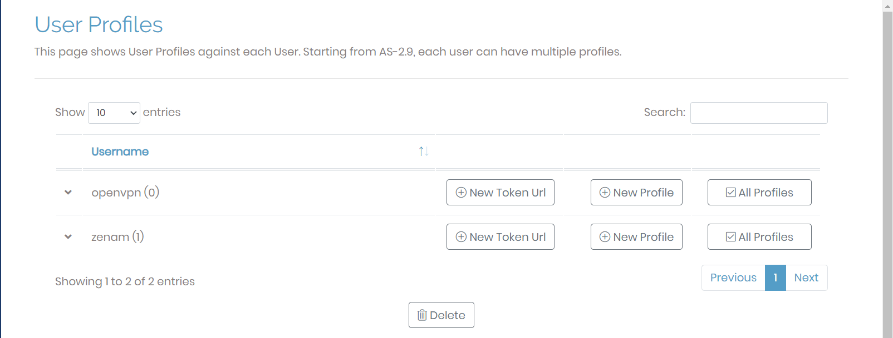
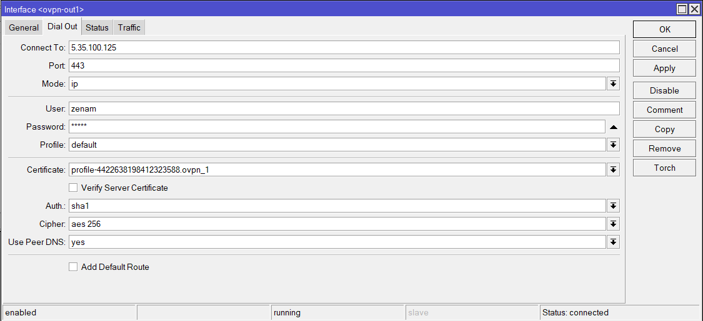
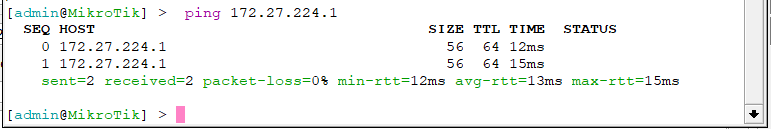

University: [ITMO University](https://itmo.ru/ru/)

Faculty: [FICT](https://fict.itmo.ru)

Course: [Network programming](https://github.com/itmo-ict-faculty/network-programming)

Year: 2023/2024

Group: K34202

Author: Malkov Evgenii Vitalevich

Lab: Lab1

Date of create: 09.10.2023

Date of finished:

# Отчёт по лабораторной работе №1 "Установка CHR и Ansible, настройка VPN"

## Цель работы

Целью данной работы является развертывание виртуальной машины с установленной системой контроля конфигураций Ansible и установка CHR в VirtualBox

## Ход работы

### Создание виртуальной машины. Установка Ansible.

Для начала арендуем частный виртуальный сервер. Подлкючимся к нему по ssh и обновим систему с помощью следующих команд:

```bash
sudo apt update & sudo apt upgrade
```

Далее установим необходимые пакеты:

```bash
sudo apt install python3-pip
sudo pip3 install ansible
```

В результате получим установленный Ansible:

<p align="center" style="padding: 0; margin:0; ">

 <p align="center" style="padding: 0; margin:0; ">Рисунок 1 - Установленный Ansible</p>
</p>

### Создание VPN сервера.

Для создания VPN сервера воспользуемся продуктом OpenVPN Access Server. Для развёртывания VPN сервера воспользуемся следующей командой:

```bash
apt update && apt -y install ca-certificates wget net-tools gnupg
wget https://as-repository.openvpn.net/as-repo-public.asc -qO /etc/apt/trusted.gpg.d/as-repository.asc
echo "deb [arch=amd64 signed-by=/etc/apt/trusted.gpg.d/as-repository.asc] http://as-repository.openvpn.net/as/debian jammy main">/etc/apt/sources.list.d/openvpn-as-repo.list
apt update && apt -y install openvpn-as
```

В результате работы команды получим ссылку на веб-интерфейс, а также логин и пароль администратора:

<p align="center" style="padding: 0; margin:0; ">

    <p align="center" style="padding: 0; margin:0; ">Рисунок 2 - Ссылка на веб-интерфейс, логин и пароль администратора</p>
</p>
Далее переходим по ссылке указанной в консоли и авторизуемся с помощью логина и пароля администратора. Введём Activation Key, который можно получить на сайте https://openvpn.net/. В результате получаем возможность подключить 2 клиента к VPN серверу.
<p align="center" style="padding: 0; margin:0; ">

    <p align="center" style="padding: 0; margin:0; ">Рисунок 3 - Веб-интерфейс OpenVPN Access Server</p>
</p>
Далее создадим пользователя, который будет использоваться для подключения к VPN серверу, а также скачаем конфигурационный файл для подключения к VPN серверу. Для этого перейдём во вкладку User Permissions и нажмём на кнопку Add User, после чего перейдём во вкладку Users Profiles и сформируем конфигурационный файл для подключения к VPN серверу.
<p align="center" style="padding: 0; margin:0; ">

    <p align="center" style="padding: 0; margin:0; ">Рисунок 4 - Получение конфигурационного файла для подключения к VPN серверу</p>
</p>

### Покдлючение к VPN серверу c CHR.

Для начала создадим виртуальную машину с установленной системой CHR. Для этого скачаем образ CHR с официального сайта Mikrotik https://mikrotik.com/download. Далее подключимся к ней с помощью WinBox и добавим ранее скачанный конфигурационный файл для подключения к VPN серверу. Для этого перейдём загрузим его в файлы, и введём следующую команду:

```
certificate import file-name=<FILENAME>
```

Далее создадим новый интерфейс OVPN client с именем ovpn-out1 и зададим следующие натройки:

- Connect to: 5.35.100.125 - белый IP нашего VPN сервера
- Port: 443
- User: zenam
- Certificate: Ранее полученный сертификат
<p align="center" style="padding: 0; margin:0; ">

    <p align="center" style="padding: 0; margin:0; ">Рисунок 4 - Создание сетевого интерфейса OVPN client</p>
</p>
Как мы можем заметить на картинке выше соединение было успешно создано. Также проверим соединение, пропинговав устройство из локальной сети. Пинг проходит успешно. 
<p align="center" >

    <p align="center" style="padding: 0; margin:0; ">Рисунок 5 - ping устройства из внутренней</p>
</p>
<p>

## Вывод

В результате выполнения лабораторной работы был развёрнут сервер автоматизации с установленной системой контроля конфигураций Ansible и установленна виртуальная машина с CHR. Между ними был настроен VPN тунель с помощью openVPN.
