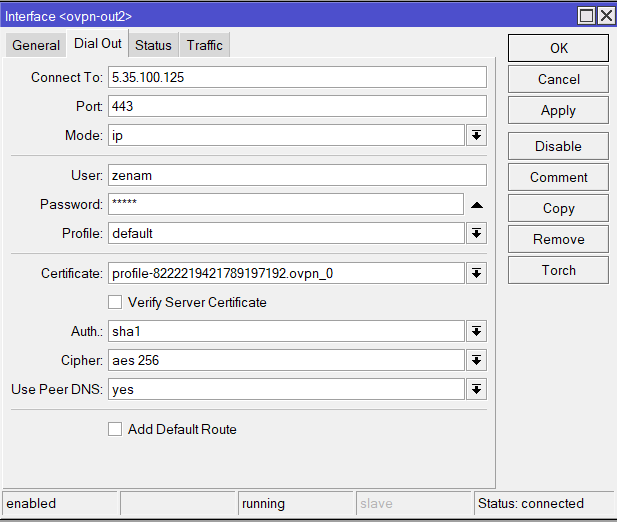
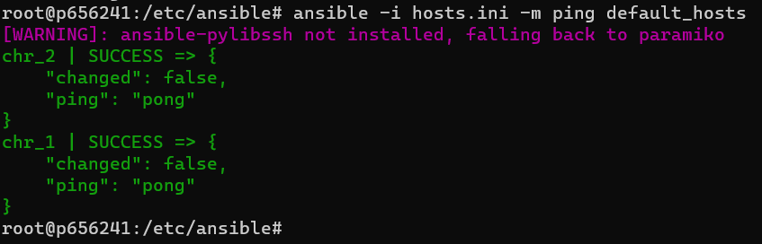
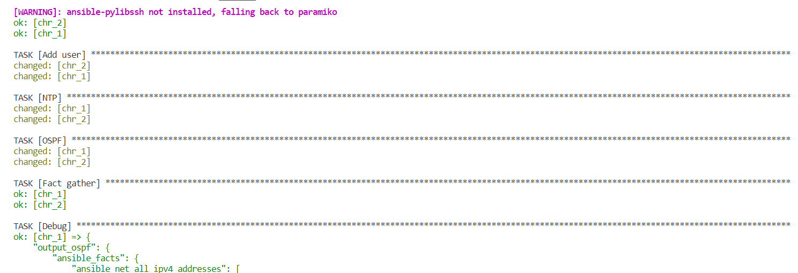
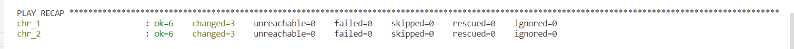
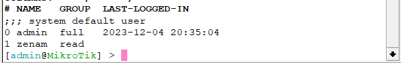
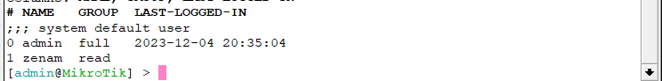
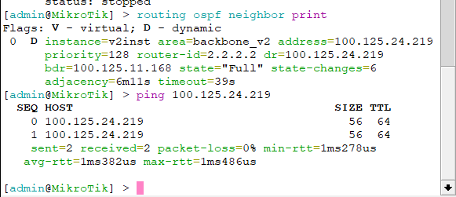
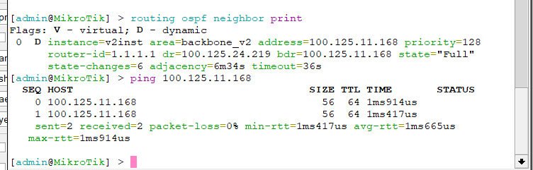
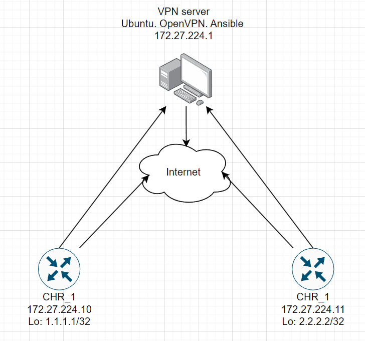

University: [ITMO University](https://itmo.ru/ru/)

Faculty: [FICT](https://fict.itmo.ru)

Course: [Network programming](https://github.com/itmo-ict-faculty/network-programming)

Year: 2023/2024

Group: K34202

Author: Malkov Evgenii Vitalevich

Lab: Lab2

Date of create: 10.11.2023

Date of finished:

# Отчёт по лабораторной работе №2 "Развертывание дополнительного CHR, первый сценарий Ansible"

## Цель работы

С помощью Ansible настроить несколько сетевых устройств и собрать информацию о них. Правильно собрать файл Inventory.

## Ход работы

Для начала был установлен второй CHR на ПК. В OpenVPN Access Server был добавлен второй клиент, и CHR был успешно подключен к VPN.(Рисунок 1).

<p align="center" style="padding: 0; margin:0; ">

    <p align="center" style="padding: 0; margin:0; ">Рисунок 1 - Второй CHR успешно подключен к VPN</p>
</p>
Далее на сервере автоматизации был изменён inventory-файл, в нём мы указали информацию о наших хостах - chr_1 и chr_2, объединённых в группу default_hosts. По итогу, Inventory файл имееет следующий вид:

```ini
[default_hosts]
chr_1 ansible_host=172.27.224.10 rid=1.1.1.1
chr_2 ansible_host=172.27.224.11 rid=2.2.2.2

[default_hosts:vars]
ansible_connection=ansible.netcommon.network_cli
ansible_network_os=community.routeros.routeros
ansible_user=admin
ansible_ssh_pass=admin
```

Проверим доступность хостов с помощью команды ping:

```bash
ansible -i hosts.ini -m ping default_hosts
```

<p align="center" style="padding: 0; margin:0; ">

    <p align="center" style="padding: 0; margin:0; ">Рисунок 2 -  Проверка доступности хостов</p>
</p>
Далее создадим playbook, который будет устанавливать login и пароль на хостах, настраивать NTP клиент, а также настраивать ospf с указанием router id – rid, указанный в inventory файле, а также выведет информацию о хостах. Playbook имеет следующий вид:

```yaml
- name: CHR config
  hosts: default_hosts
  tasks:
    - name: Add user
      routeros_command:
        commands:
          - /user add name=zenam group=read password=zenam

    - name: NTP
      routeros_command:
        commands:
          - /system ntp client set enabled=yes server=system ntp client set enabled=yes servers=8.8.8.8

    - name: OSPF
      routeros_command:
        commands:
          - /interface bridge add name=Lo
            - /ip address add address="{{ rid }}"/32 interface=Lo
            - /routing ospf instance add name=v2inst version=2 router-id="{{ rid }}"
            - /routing ospf area add name=backbone_v2 area-id=0.0.0.0 instance=v2inst
            - /routing ospf interface-template add network=0.0.0.0/0 area=backbone_v2

    - name: Fact gather
      routeros_facts:
        gather_subset:
          - interfaces
      register: output_ospf

    - name: Debug
      debug:
        var: "output_ospf"
```

Все задачи успешно выполнились:

<p align="center" style="padding: 0; margin:0; ">


    <p align="center" style="padding: 0; margin:0; ">
Рисунок 3 -  Playbook успешно выполнен</p>
    </p>
</p>
Проверим созданных пользователей на хостах:
<p align="center" style="padding: 0; margin:0; ">


    <p align="center" style="padding: 0; margin:0; ">
Рисунок 4 -  Проверка созданных пользователей</p>
    </p>
</p>

Далее проверим связность между хостами и OSPF:

<p align="center" style="padding: 0; margin:0; ">


    <p align="center" style="padding: 0; margin:0; ">
Рисунок 6 -  Проверка связности между хостами и OSPF
    </p>
</p>
Схема (Рисунок 7):
<p align="center" style="padding: 0; margin:0; ">

    <p align="center" style="padding: 0; margin:0; ">
      Рисунок 7 -  Схема
    </p>
</p>
Полную  информацию о хостах можно получить с помощью найти в выводе playbook:

[CHR_1_conf](./chr_1_conf.txt)
[CHR_2_conf](./chr_2_conf.txt)

## Вывод

В результате выполнения лабораторной работы были получены навыки работы с Ansible, а также были настроены хосты с помощью playbook.
