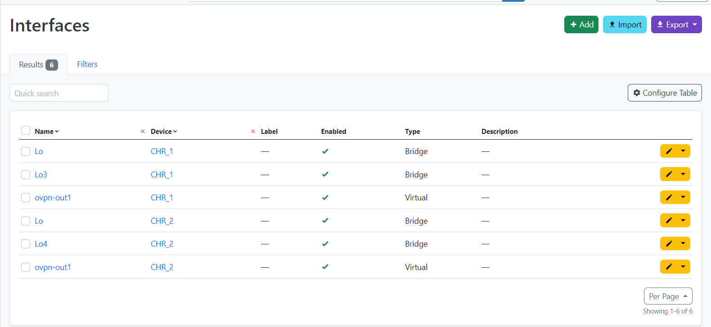
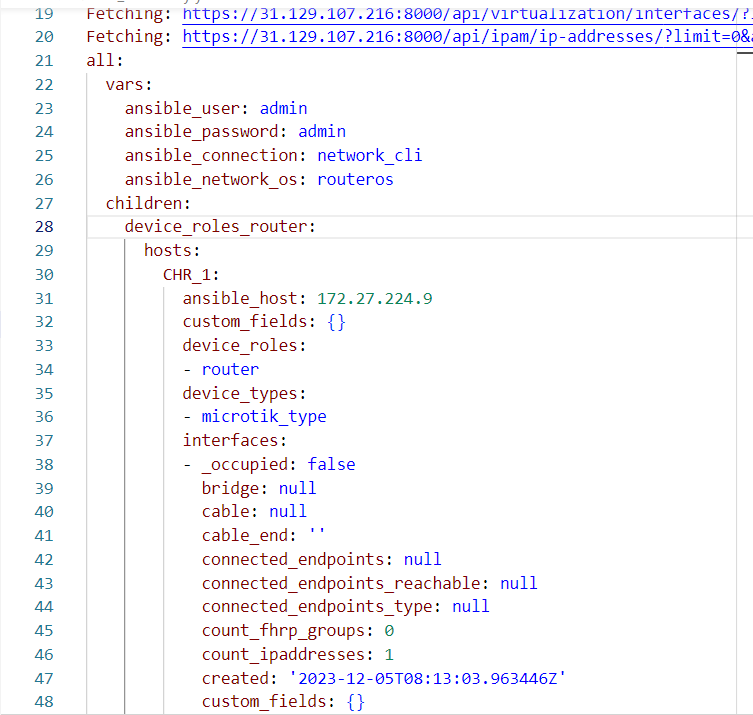

University: [ITMO University](https://itmo.ru/ru/)

Faculty: [FICT](https://fict.itmo.ru)

Course: [Network programming](https://github.com/itmo-ict-faculty/network-programming)

Year: 2023/2024

Group: K34202

Author: Malkov Evgenii Vitalevich

Lab: Lab3

Date of create: 20.11.2023

Date of finished:

# Отчёт по лабораторной работе №3 "Развертывание Netbox, сеть связи как источник правды в системе технического учета Netbox"

## Цель работы

С помощью Ansible и Netbox собрать всю возможную информацию об устройствах и сохранить их в отдельном файле.

## Ход работы

### 1. Поднятие Netbox

Поднимем Netbox на ранее созданной виртуальной машине. Для этого произведём следующие действия:

1. Установим PostgreSQL:

```bash
sudo apt install -y postgresql
```

2. Подключимся к PostgreSQL:

```bash
sudo -u postgres psql
```

3. Создаем базу данных и пользователя netbox:

```bash
CREATE DATABASE netbox;
CREATE USER netbox WITH PASSWORD 'netbox';
ALTER DATABASE netbox OWNER TO netbox;
```

4. Проверим возможность подключения к базе данных:
<p align="center" style="padding: 0; margin:0; ">

</p>

5. Установим Redis:

```bash
sudo apt install -y redis-server
```

6. Проверим работу Redis:

<p align="center" style="padding: 0; margin:0; ">

</p>

7. Установим пакеты, необходимые для работы Netbox:

```bash
sudo apt install -y python3 python3-pip python3-venv python3-dev build-essential libxml2-dev libxslt1-dev libffi-dev libpq-dev libssl-dev zlib1g-dev
```

8. Создадим директорию для работы с Netbox и клонируем в неё репозиторий Netbox:

```bash
sudo mkdir -p /opt/netbox/
cd /opt/netbox/
sudo git clone -b master --depth 1 https://github.com/netbox-community/netbox.git .
```

10. Создадим системного пользователя netbox:

```bash
sudo adduser --system --group netbox
sudo chown --recursive netbox /opt/netbox/netbox/media/
sudo chown --recursive netbox /opt/netbox/netbox/reports/
sudo chown --recursive netbox /opt/netbox/netbox/scripts/
```

11. Скопируем файл configuration_example.py в качестве configuration.py по пути /opt/netbox/netbox/netbox/:

```bash
cd /opt/netbox/netbox/netbox/
sudo cp configuration_example.py configuration.py
```

12. Сгенерируем секретный ключ:

```bash
sudo python3 /opt/netbox/netbox/generate_secret_key.py
```

13. Настроим конфигурационный файл:

```bash
ALLOWED_HOSTS = ['*']
DATABASE = {
    'NAME': 'netbox',               # Database name
    'USER': 'netbox',               # PostgreSQL username
    'PASSWORD': '<password>', # PostgreSQL password
    'HOST': 'localhost',            # Database server
    'PORT': '',                     # Database port (leave blank for default)
    'CONN_MAX_AGE': 300,            # Max database connection age (seconds)
}

SECRET_KEY = 'сгенерированный_секретный_ключ'
```

14. Запустим upgrade-скрипт, который создаст виртуальную среду Python, установит необходимые пакеты Python, запустит миграции схемы базы данных.

```bash
sudo /opt/netbox/upgrade.sh
```

15. Зайдём в созданную виртуальную среду Python и создадим суперпользователя:

```bash
source /opt/netbox/venv/bin/activate
cd /opt/netbox/netbox
python3 manage.py createsuperuser
```

16. Установим gunicorn. Для этого для начала копируем конфигурационный файл gunicorn, необходимые файлы netbox и перезагрузим demon systemd:

```bash
sudo cp /opt/netbox/contrib/gunicorn.py /opt/netbox/gunicorn.py
sudo cp -v /opt/netbox/contrib/*.service /etc/systemd/system/
sudo systemctl daemon-reload
```

17. Запустим сервисы netbox и проверим их статус:

```bash
sudo systemctl start netbox netbox-rq
sudo systemctl enable netbox netbox-rq
```

<p align="center" style="padding: 0; margin:0; ">

</p>

18. Далее установим nginx:

```bash
sudo apt install -y nginx
```

19. Копируем конфигурационный файл nginx:

```bash
sudo cp /opt/netbox/contrib/nginx.conf /etc/nginx/sites-available/netbox
sudo rm /etc/nginx/sites-enabled/default
sudo ln -s /etc/nginx/sites-available/netbox /etc/nginx/sites-enabled/netbox
sudo systemctl restart nginx
```

20. Исправим файл конфигурации nginx так, чтобы сайт разворачивался на порту 8000, т.к. 443 порт занят службой openvpn

В результате Netbox был успешно установлен и запущен. Проверим работу Netbox, перейдя по адресу https://31.129.107.216:8000

<p align="center" style="padding: 0; margin:0; ">

</p>

### 2. Заполенение информации о CHR в Netbox

После развёртывания Netbox, авторизуемся в нём и заполним информацию основную информацию в Netbox - сайт, роли, производителей, тип устройств, интерфейсы, ip адреса.  
Далее добавим информацию о устройствах. Для этого перейдём в раздел Devices, найдём пункт Add, нажмём на него и заполним информацию о устройстве.
В итоге получим следующую информацию:

<p align="center" style="padding: 0; margin:0; ">



</p>

### 3. Создание скрипта для сбора информации об устройствах

Используя Ansible и модуль netbox_netbox_device_info, создадим скрипт для сбора информации об устройствах. Для этого создадим файл netbox_device_info.yml и заполним его следующим образом:

```yaml
plugin: netbox.netbox.nb_inventory
api_endpoint: https://31.129.107.216:8000
token: токен
validate_certs: False
config_context: False
group_by:
  - device_roles
interfaces: "True"
```

Токен был ранее сгенерирован в Netbox.

<p align="center" style="padding: 0; margin:0; ">

</p>
Далее запустим скрипт и запишем полученный результат в файл  nb_inventory.yml:

```bash
ansible-inventory -v --list -y -i  netbox_device_info.yml > nb_inventory.yml
```

По итогу мы получаем файл nb_inventory.yml, в котором содержится информация об устройствах. Для удобства добавим в файл nb_inventory.yml переменные для подлкючения к роутерам. Полную версию файла можно посмотреть [здесь](./nb_inventory.yml).

<p align="center" style="padding: 0; margin:0; ">

</p>

### 4. Настойка 2 CHR с помощью Ansible на основе данных из Netbox

Напишем playbook для настройки двух роутеров. Для этого создадим файл routers.yml и заполним его следующим образом:

```yaml
- name: Configure routers
  hosts: device_roles_router
  tasks:
    - name: Set hostname
      community.routeros.command:
        commands:
          - /system identity set name="{{interfaces[0].device.name}}"
    - name: Set ip address
      community.routeros.command:
        commands:
          - /interface bridge add name="{{interfaces[1].display}}"
          - /ip address add address="{{interfaces[1].ip_addresses[0].address}}" interface="{{interfaces[1].display}}"
```

Выполним playbook и проверим результат:

<p align="center" style="padding: 0; margin:0; ">


</p>

### 5. Сбор данных с роутеров в Netbox

Напишем playbook, позволяющий собирать серийный номер и модель устройства, а также вносящий серийный номер в Netbox, на основе inventory-файла nb_inventory.yml. Для этого создадим файл routers_gather.yml и заполним его следующим образом:

```yaml
- name: Gather information from routers
  hosts: device_roles_router
  tasks:
    - name: Get Serial Number
      community.routeros.command:
        commands:
          - /system license print
      register: license_print
    - name: Get Name
      community.routeros.command:
        commands:
          - /system identity print
      register: identity_print
    - name: Add Serial Number to Netbox
      netbox_device:
        netbox_url: https://31.129.107.216:8000
        netbox_token: токен
        data:
          name: "{{identity_print.stdout_lines[0][0].split(' ').1}}"
          serial: "{{license_print.stdout_lines[0][0].split(' ').1}}"
        state: present
        validate_certs: False
```

Выполним playbook:

<p align="center" style="padding: 0; margin:0; ">

</p>

Произведём проверку в Netbox:

<p align="center" style="padding: 0; margin:0; ">


</p>
Как мы можем заметить, серийный номер был успешно добавлен в Netbox.

## Вывод

В результате выполнения лабораторной работы был развёрнут Netbox, заполнена информация об устройствах, а также был написан скрипт для сбора информации об устройствах и playbook для сбора данных с роутеров в Netbox.
