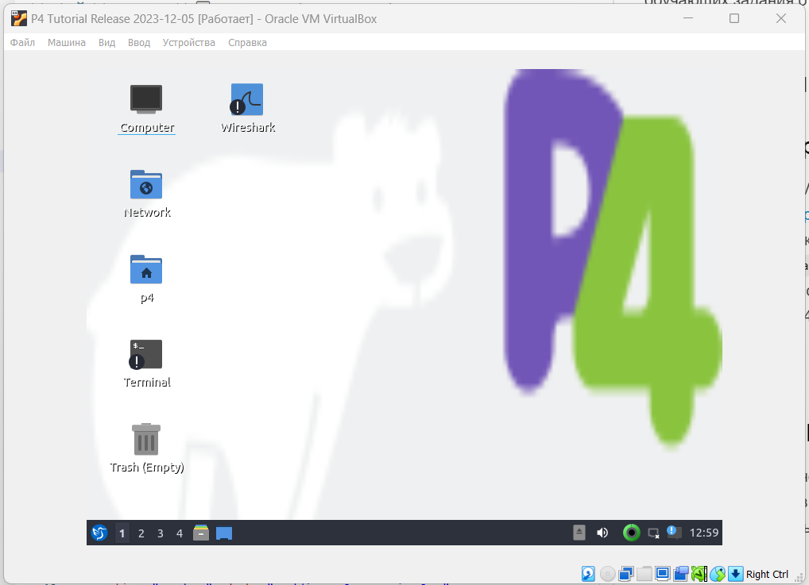
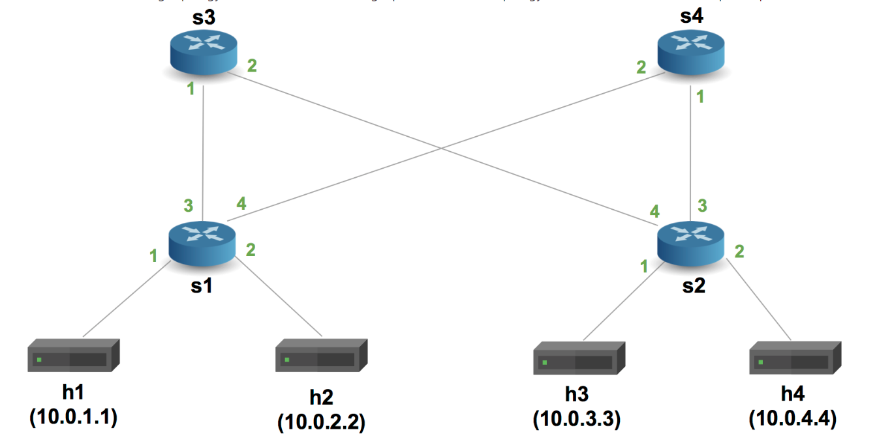
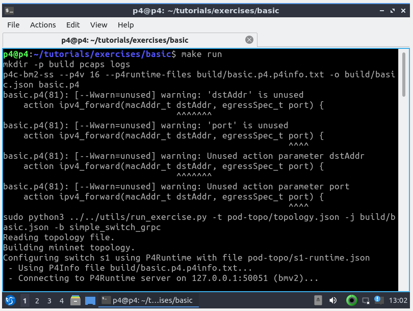
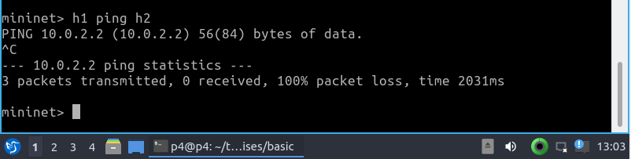
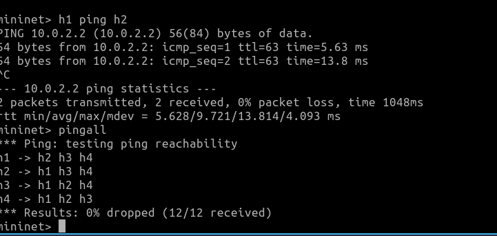
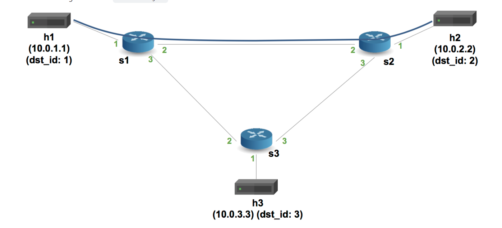
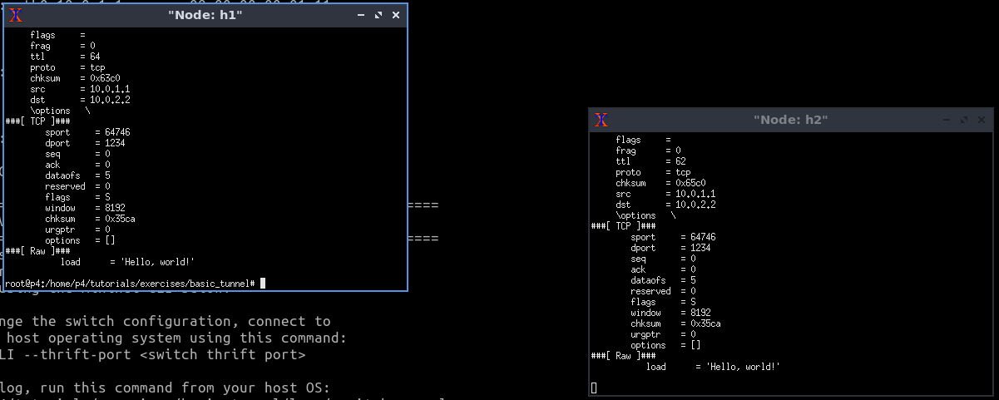
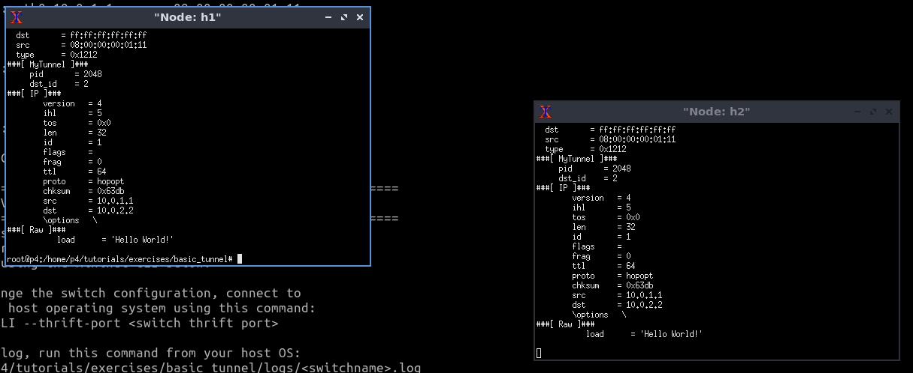

University: [ITMO University](https://itmo.ru/ru/)

Faculty: [FICT](https://fict.itmo.ru)

Course: [Network programming](https://github.com/itmo-ict-faculty/network-programming)

Year: 2023/2024

Group: K34202

Author: Malkov Evgenii Vitalevich

Lab: Lab4

Date of create: 01.12.2023

Date of finished:

# Отчёт по лабораторной работе №3 "Базовая 'коммутация' и туннелирование используя язык программирования P4"

## Цель работы

Изучить синтаксис языка программирования P4 и выполнить 2 обучающих задания от Open network foundation для ознакомления на практике с P4.

## Ход работы

### Установка виртуальной машины

Установим Vagrant и VirtualBox на хостовую машину, после чего склонируем [репозиторий](https://github.com/p4lang/tutorials) с готовой виртуальной машиной для работы с P4. Перейдём в папку vm-ubuntu-20.04 и развернёт тестовую среду с помощью команды `vagrant up`. В результате будет развёрнута виртуальная машина с Ubuntu 20.04, с аккаунтами login/password vagrant/vagrant и p4/p4. Зайдём в виртуальную машину под учётной записью p4.

<p align="center" style="padding: 0; margin:0; ">

</p>

### Implementing Basic Forwarding

В виртуальной машине перейдем в папку проекта и выполним задания, описанные в [Implementing Basic Forwarding](https://github.com/p4lang/tutorials/tree/master/exercises/basic).
В этом упражнении мы будем использовать следующую топологию:

<p align="center" style="padding: 0; margin:0; ">

</p>

В корневой директории проекта находится файл `basic.ps4`, который мы будем изменять. Для начала запустим тестовую среду, используя команду `make run`:

<p align="center" style="padding: 0; margin:0; ">

</p>

Протестируем работу сети, отправив ping от хоста h1 к хосту h2. Пинги не проходят:

<p align="center" style="padding: 0; margin:0; ">

</p>

Выйдем из командной строки mininet, остановим её, а также удалим все созданные файлы с помощью следующих команд:

```
make stop
make clean
```

Начнём изменять файл `basic.p4`. Обновим парсер который позволяет заполнять заголовки ethernet_t, ipv4_t:

```bash
parser MyParser(packet_in packet,
                out headers hdr,
                inout metadata meta,
                inout standard_metadata_t standard_metadata) {

    state start {
        /* TODO: add parser logic */
        transition parse_ethernet;
        #transition accept;
    }

    state parse_ethernet {
        packet.extract(hdr.ethernet);
        transition select(hdr.ethernet.etherType) {
            TYPE_IPV4 : parse_ipv4;
            default : accept;
        }
    }

    state parse_ipv4 {
        packet.extract(hdr.ipv4);
        transition accept;
    }
}
```

Далее дополним функцию ip4_forward. Добавим определение выходного порта, обновление адреса назначения и источника отправления пакета, а также уменьшение TTL на 1:

```bash
action ipv4_forward(macAddr_t dstAddr, egressSpec_t port) {
        standard_metadata.egress_spec = port;
        hdr.ethernet.srcAddr = hdr.ethernet.dstAddr;
        hdr.ethernet.dstAddr = dstAddr;
        hdr.ipv4.ttl = hdr.ipv4.ttl - 1;
}
```

Далее обеспечим применение ipv4_lpm при наличии валидного заголовка ipv4:

```bash
apply {
        if (hdr.ipv4.isValid()) {
            ipv4_lpm.apply();
        }
    }
```

Снова запустим тестовую среду и проверим работу сети. Пинги проходят, сеть работает правильно:

<p align="center" style="padding: 0; margin:0; ">

</p>

### Implementing Basic Tunneling

В виртуальной машине перейдите в папку проекта и выполните задания описанные в [Implementing Basic Tunneling](https://github.com/p4lang/tutorials/tree/master/exercises/basic_tunnel).
В этом задании мы будем реализовывать следующую топологию:

<p align="center" style="padding: 0; margin:0; ">

</p>

Перейдём по пути ~/tutorials/exercises/basic_tunnel и внесём изменения в файл файл basic_tunnel.p4.
Добавим парсер parse_myTunnel, извлекающий заголовок myTunnel. Если значение поля proto_id будет равно 0x800, то происходит переход к парсеру parse_ipv4:

```bash
state parse_ethernet {
    packet.extract(hdr.ethernet);
    transition select(hdr.ethernet.etherType) {
        TYPE_IPV4 : parse_ipv4;
        TYPE_MYTUNNEL : parse_myTunnel;
        default : accept;
    }
}
```

Допишем парсер parse_ethernet так, чтобы об извлекал заголовок myTunnel либо ipv4 в зависимости от значения etherType.

```bash
state parse_myTunnel {
    packet.extract(hdr.myTunnel);
    transition select(hdr.myTunnel.proto_id) {
        TYPE_IPV4 : parse_ipv4;
        default : accept;
    }
}
```

Определим таблицу myTunnel_exact, которая будет использоваться маршрутизации пакетов myTunnel. Для этого добавим следующий код в секцию v1model:

```bash
#// TODO: declare a new action: myTunnel_forward(egressSpec_t port)
action myTunnel_forward(egressSpec_t port) {
    standard_metadata.egress_spec = port;
}
#// TODO: declare a new table: myTunnel_exact
#// TODO: also remember to add table entries!
table myTunnel_exact {
    key = {
        hdr.myTunnel.dst_id: exact;
    }
    actions = {
        myTunnel_forward;
        drop;
        NoAction;
    }
    size = 1024;
    default_action = NoAction();
}
apply {
    #// TODO: Update control flow
    if (hdr.ipv4.isValid() && !hdr.myTunnel.isValid()) {
        ipv4_lpm.apply();
    }
    if (hdr.myTunnel.isValid()) {
        myTunnel_exact.apply();
    }
}
```

Допишем депарсер:

```bash
control MyDeparser(packet_out packet, in headers hdr) {
    apply {
        packet.emit(hdr.ethernet);
        #// TODO: emit myTunnel header as well
        packet.emit(hdr.myTunnel);
        packet.emit(hdr.ipv4);
    }
}
```

Протестируем работу сети. Откроем 2 терминала командой `xterm h1 h2`. Поднимем сервер на h2 командой `./receive.py`. На h1 выполним команду `./send.py 10.0.2.2 "Hello, world!"`. Пакеты успешно доставлены:

<p align="center" style="padding: 0; margin:0; ">

</p>

Далее при отправке сообщения укажем флаг --dst_id 2. В этом случае пакет всё равно дойдет до h2.

<p align="center" style="padding: 0; margin:0; ">

</p>

### Вывод

Выполнив данную работу мы изучили синтаксис языка программирования P4 и выполнили 2 обучающих задания от Open network foundation для ознакомления на практике с P4.
